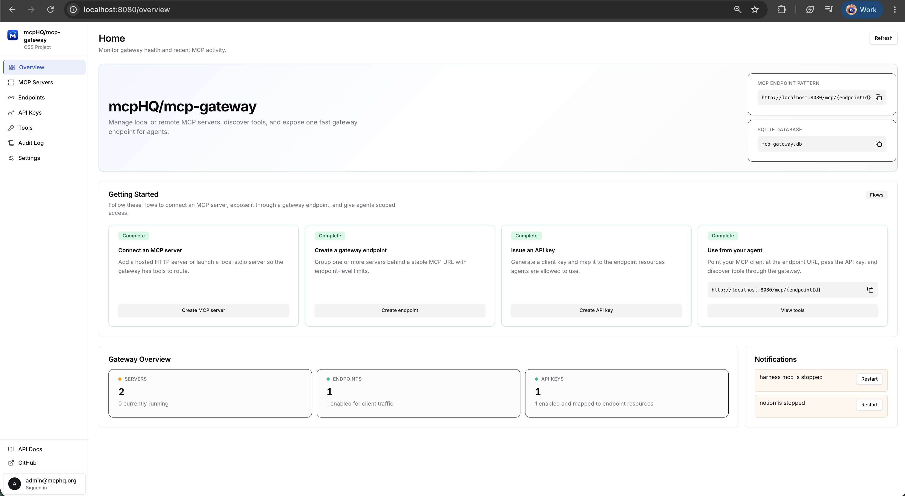

# MCP Gateway

An open source control plane for [Model Context Protocol](https://modelcontextprotocol.io/) (MCP) servers. Connect HTTP and stdio MCP servers, discover tools, group them into scoped endpoints, and manage secrets, rate limits, API keys, and usage from one lightweight Go service with a built-in web UI.



## Quick start

```bash
docker run --rm -p 8080:8080 -v mcp-gateway-data:/data ghcr.io/mcphq/mcp-gateway
```

Open [http://localhost:8080](http://localhost:8080) and sign in with the default admin account (`admin@mcphq.org` / `admin`). Change the password after first login.

Gateway state is stored in the `mcp-gateway-data` volume at `/data/mcp-gateway.db`.

## Deploy on Kubernetes

With Helm:

```bash
helm install mcp-gateway ./charts/mcp-gateway \
  --namespace mcp-gateway --create-namespace \
  --set gateway.adminPassword=change-me
```

Or with plain manifests:

```bash
kubectl apply -k deploy/kubernetes
```

See [charts/mcp-gateway](charts/mcp-gateway/README.md) and [deploy/kubernetes](deploy/kubernetes/README.md) for configuration options (ingress, persistence, secrets, upstream token interpolation).

## Documentation

- [DEVELOPMENT.md](DEVELOPMENT.md) — local setup, configuration, API examples, frontend and backend development
- [charts/mcp-gateway](charts/mcp-gateway/README.md) — Helm chart
- [deploy/kubernetes](deploy/kubernetes/README.md) — plain Kubernetes manifests

## Project status

MCP Gateway is an early OSS project. Core gateway, admin UI, SQLite persistence, OpenAPI workflow, endpoint scoping, API keys, usage metrics, and audit logging are in place; production hardening is ongoing. Contributions are welcome.
